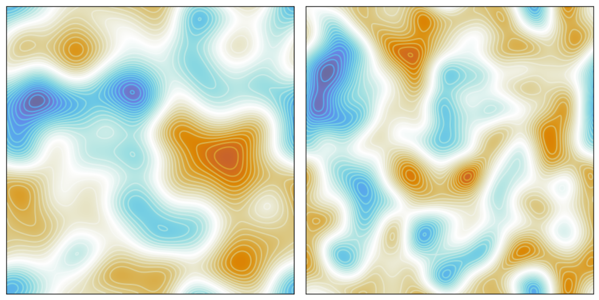

# 📃 Notebook: `compute-okuboweiss-field`
In this notebook, we compute and visualize the Okubo-Weiss field for a randomly generated stream function.

## 🎯 Goal

The goal of this project is to demonstrate the computation of the **Okubo-Weiss parameter** $Q$, which is used to distinguish between strain-dominated ($Q > 0$) and vorticity-dominated ($Q < 0$) regions in a two-dimensional flow field. By using a **synthetic, randomly generated stream function** $\psi$, the notebook illustrates how to derive velocity fields, compute vorticity, and calculate the Okubo-Weiss field. Numerical validation checks are included both as automated tests and visualized.

## 🔧 Method

This notebook presents a spectral method for computing derivatives and fields in fluid dynamics:
- Generate a random stream function $\psi$ using Gaussian filtering of a two-dimensional white noise field.
- Derive velocity components $\vec{\mathbf{u}}=(v_x, v_y)$ from the stream function using spectral differentiation.
- Compute the vorticity from the velocity field: $\omega = \partial v_y / \partial x - \partial v_x / \partial y$.
- Compute the Okubo-Weiss field: $Q = (\partial^2 \psi / \partial x \partial y)^2 - (\partial^2 \psi / \partial x^2)(\partial^2 \psi / \partial y^2)$.
- Perform numerical checks to validate that the derived velocities satisfy the continuity condition ($\nabla \cdot \vec{v} = 0$) and other stream function properties.
- Visualize all fields using plots with custom colormaps and streamlines.

## 💻 Code

The notebook can be found in the `./notebooks/` folder. The functions used in the notebook can be found in the `./src/` folder.

## 📊 Tests

Run tests with:
```bash
$ cd compute-okuboweiss-field
$ python -m unittest tests/test_properties.py
```

The tests verify:
- The continuity equation ($\nabla \cdot \vec{v} \approx 0$) for velocities derived from a stream function $\psi$.
- Numerical relationships between velocity components and stream function derivatives.
- That the implementation correctly handles random vs. stream-function-derived fields.

## 📊 Results



The notebook computes and visualizes:
- The synthetic, randomly generated stream function $\psi$ with its isolines.
- The velocity field components $v_x$ and $v_y$ and their magnitude $|\vec{\mathbf{u}}|$.
- The vorticity $\omega$ with overlaid streamlines to indicate the direction of the flow.
- The Okubo-Weiss field $Q$, highlighting strain ($Q > 0$, blue) and vorticity ($Q < 0$, red) dominated regions with different colors.
- Numerical validation plots showing continuity and derivative relationships on logarithmic scales. Highlighting the correctness of the equations and the numerical implementation.

## 📚 References

[1] Okubo, Akira. "Horizontal dispersion of floatable particles in the vicinity of velocity singularities such as convergences." Deep sea research and oceanographic abstracts. Vol. 17. No. 3. Elsevier, 1970.

[2] Weiss, John. "The dynamics of enstrophy transfer in two-dimensional hydrodynamics." Physica D: Nonlinear Phenomena 48.2-3 (1991): 273-294.